# NanyangYS Agent

[English](README.md) | [中文](README_CN.md)

> [!IMPORTANT]
> 请从 `main` 开始使用。它是唯一长期保留、受支持的远端分支。已合并的功能分支会被删除，但审查历史仍保留在 Pull Request 和合并提交中。

NanyangYS Agent 是一个面向**真实开源大厂视频播放数据**的轻量级、可审计的视频推荐 Agent 系统闭环。目标不是堆叠大模型，而是用更小巧、更精确的方式挖掘用户长时序视频偏好，并让系统在收到新的用户反馈后能够持续优化迭代。

### 数据基础与扩展路线

当前以快手 **KuaiRand-1K** 公开数据集为起点开展研究，后续计划逐步接入更多真实开源视频播放数据，包括腾讯、字节跳动、YouTube 等平台，以验证偏好建模与推荐策略在多源数据上的可迁移性与稳健性。

### 系统设计理念

系统参考 **Harness** 与 **Loop Engineering** 思想构建：把研究任务约束为有角色权限、预算、证据门禁、停止条件和哈希审计的可迭代闭环流程。用户更新信息（新的观看、反馈、长时序行为）可作为新一轮 loop 的输入，驱动 Agent 重新审计边界、生成特征规格、请求与评价证据、审查主张边界，并在证据与审批同时满足时发布可回滚的特征包。它不重新清洗 Silver，也不在本机训练模型，而是把"研究能否被信任"这件事本身工程化。

### 研究进展

早期演示快照曾在 **RTX 4090** 上完成 Train-only 的 BL0 / BL1 / BL2 数值核验。后续 v010-v012 研究运行记录的是 Python 3.11.15、PyTorch 2.11.0+cu128 与 RTX 5070 Ti；公开仓库保留合同和复现元数据，不直接分发对应的大型运行产物。

仓库同时提供一个不分发数据的 KuaiRand-1K 复现包：研究者从官方渠道下载数据，先核验原始文件 SHA-256，再使用冻结的数据合同、清洗规则、代码和种子重建 Silver 与后续实验。入口见 [reproducibility/README.md](reproducibility/README.md)。

## 当前真实状态

| 模块 | 当前状态 |
|---|---|
| Agent Harness | 已可离线运行和校验；无合格证据时确定性停在 `waiting_for_evidence` |
| GPU 演示快照 | 历史 Train-only 的 BL0 / BL1 / BL2 结果已做数值核验 |
| 研究 producer 证据 | v010-v012 合同、代码、种子、环境与预期哈希可复现；大型输出不入库 |
| 科学证据准入 | 未完成；provenance 冻结与 Agent Evidence manifest 尚未闭环 |
| Agent 消费端 Validation / sealed / random | 尚未准入；producer 证据不能直接替代 Agent Evidence 合同 |
| 发布 | 未授权；系统保持 fail-closed |
| 公开复现包 | 提供代码、合同、环境锁、种子和预期哈希；不包含 Raw、Silver、逐行预测或模型文件 |

GPU 快照中，BL2 相对 BL1 的初步结果为：AP `+0.041295`、event-weighted user-GAUC `+0.048758`、Log Loss `-0.022953`、Brier `-0.008907`，AP 的用户聚类 bootstrap 95% CI 为 `[0.037661, 0.045054]`。这些数字只支持 **Train-only 初步结论**，不等于 Validation、Gold 或发布结论。

## 实验图文说明

下面按照课件式叙事说明完整实验：先冻结研究范围和时间边界，再审计数据、比较 BL1/BL2、修复概率校准，最后进行内部 temporal replay，并把结论接入 fail-closed 的 Agent 证据流程。README 使用纯白背景 PNG，以保证 GitHub 深色和浅色主题下都能清楚阅读；原透明版本保存在 [`docs/assets/experiment-story/transparent-backup/`](docs/assets/experiment-story/transparent-backup/)。

BL1 和 BL2 都是**稀疏逻辑回归基线**，不是神经网络。除特别说明外，下文置信区间均为 paired user-cluster bootstrap 95% CI，即以用户为聚类单位进行配对 bootstrap。这里展示的是 producer 侧实验结果，不会自动改变前文所述的 Agent Evidence 准入状态。

### 1. 先定义估计对象，再拟合模型

研究首先区分总体、曝光域、时间窗口和最终可评价行集，避免把一个范围内测得的增益无条件推广到另一个范围。

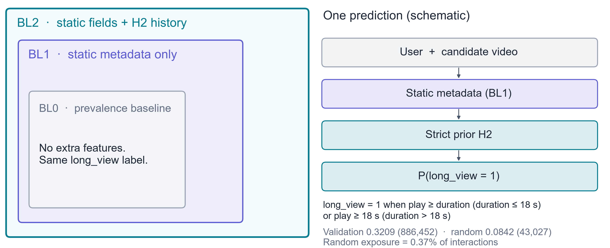

随后为每一类字段规定 point-in-time 可用性：只有在目标事件发生时已经能够获得的信息才能进入特征；事后统计量不能冒充历史特征。

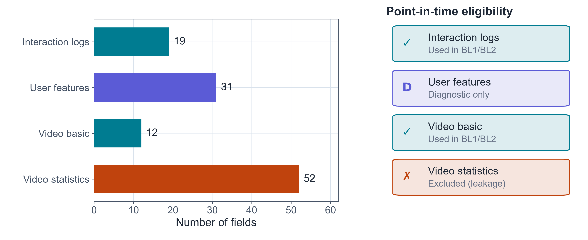

**本节结论：** 在模型比较之前，先冻结“哪些用户、哪个时间、哪个曝光域、哪些信息可用”。

### 2. 建模前完成数据审计

<table>
  <tr>
    <td width="50%">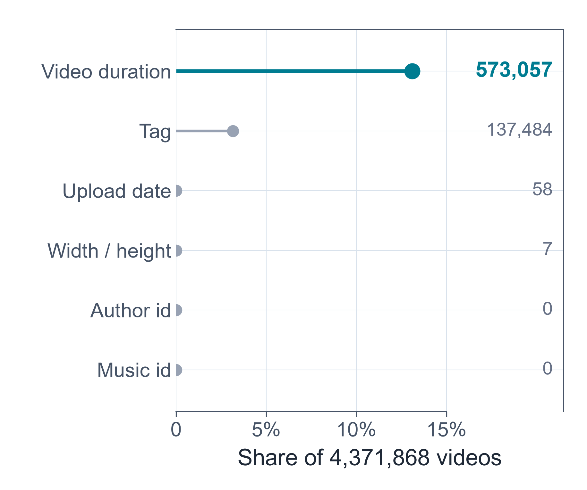</td>
    <td width="50%">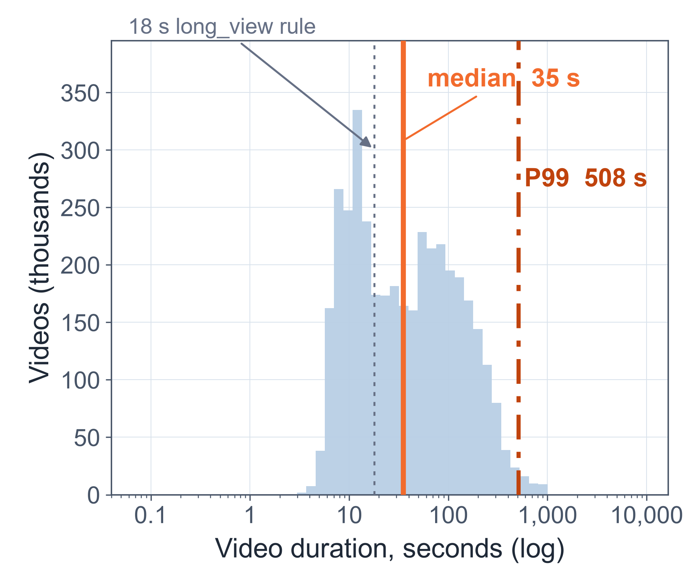</td>
  </tr>
  <tr>
    <td valign="top"><b>缺失值具有业务含义。</b> 哨兵值和字段缺失按语义审计，而不是使用一条全局删除规则。</td>
    <td valign="top"><b>视频时长明显右偏。</b> 图中分别标识中位数、18 秒参考值与长尾，避免让主体分布被尾部压缩。</td>
  </tr>
</table>

Raw 行会被核对并进入受治理的分析范围，而不是被当作一张没有边界的表。下图明确展示 early standard、late standard 与 random exposure 的数据路径。

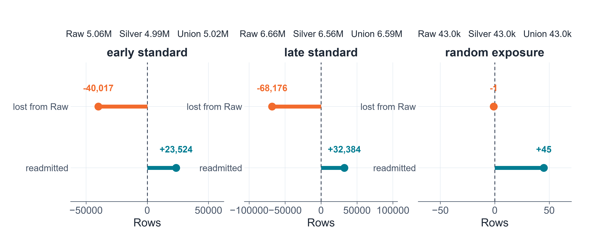

整体 pooled discrimination 与用户层面的 discrimination 回答不同问题，因此实验在 pooled 指标之外单独报告 event-weighted user-gAUC，而不是互相替代。

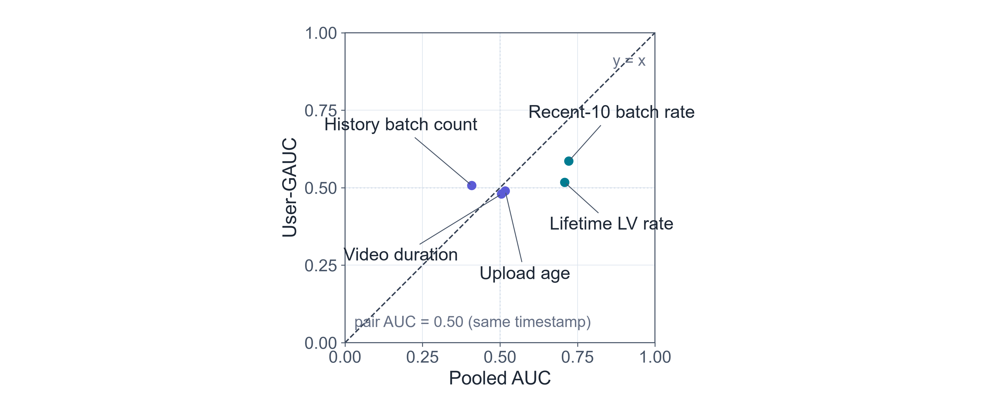

**本节结论：** 缺失语义、长尾分布、行集核对和聚合口径都属于科学设计，而不是可忽略的数据清理细节。

### 3. 构造无泄漏的嵌套特征，并诊断优化过程

BL1 与 BL2 是嵌套的稀疏逻辑回归：BL2 在相同评价合同下加入经过审计的长时序特征块，因此 BL2 − BL1 的差值具有清楚的解释。

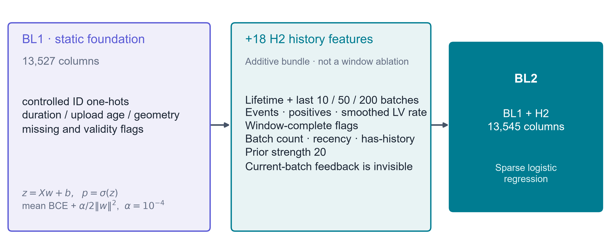

<table>
  <tr>
    <td width="50%">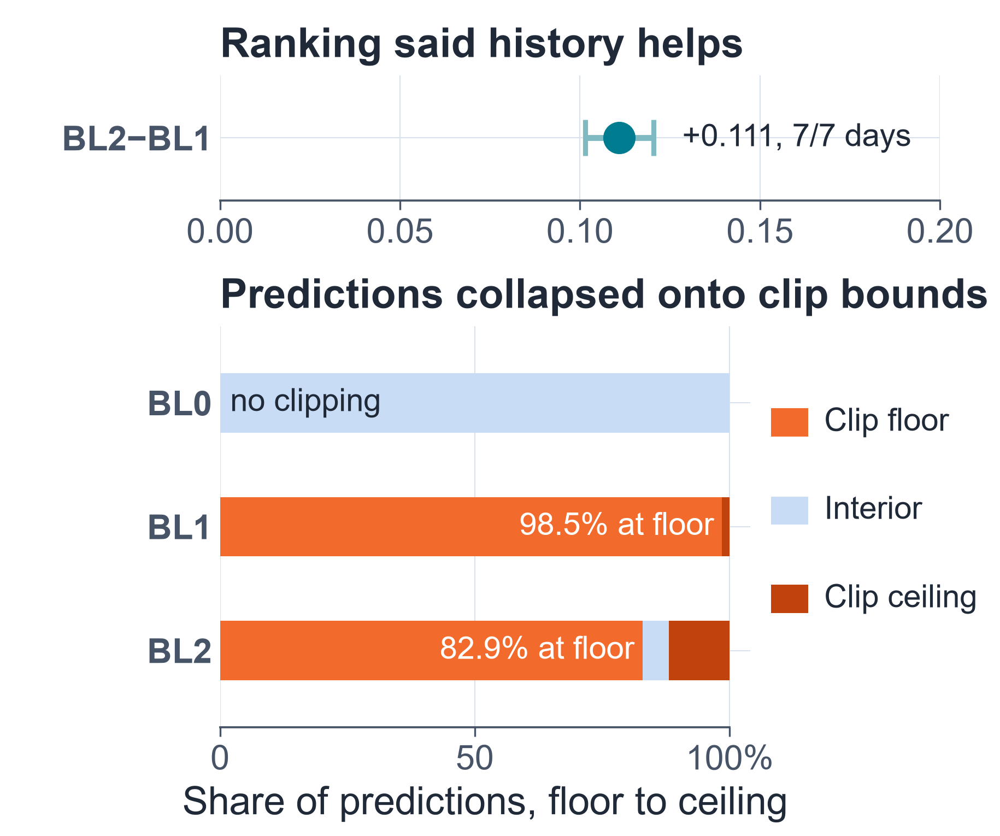</td>
    <td width="50%">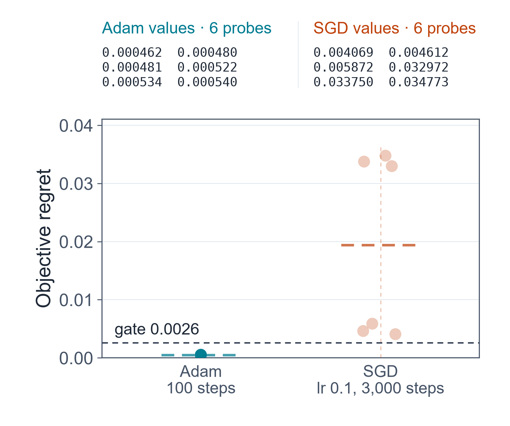</td>
  </tr>
  <tr>
    <td valign="top"><b>预测形态也是诊断证据。</b> 只看排序指标可能掩盖概率尺度上的优化问题。</td>
    <td valign="top"><b>优化器是否充分需要实测。</b> 图中把多次 Adam 拟合与已记录的 SGD 运行放在预先规定的 gate 下比较。</td>
  </tr>
</table>

冻结后的正式配置对 BL1 和 BL2 使用相同的 GPU Adam 拟合设置；优化器调整没有改变模型家族。

### 4. 冻结时间顺序，再跨数据域比较

时间审计明确分开 standard 与 random exposure，并记录各阶段实际消费的时间片段。

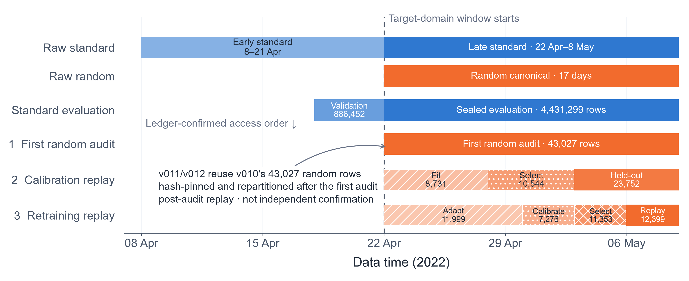

v010 的 random canonical 片段包含 **43,027 行**。v011 和 v012 的 ledger 都核对回同一个 43,027 行、由哈希固定的 canonical 片段。因此它们属于 **post-audit temporal replay**，不是新的独立数据确认。

主结果使用三个共同 0–1 坐标的 P-R 小倍图，并在下方使用独立 forest panel 展示 paired user-cluster bootstrap 效应量。

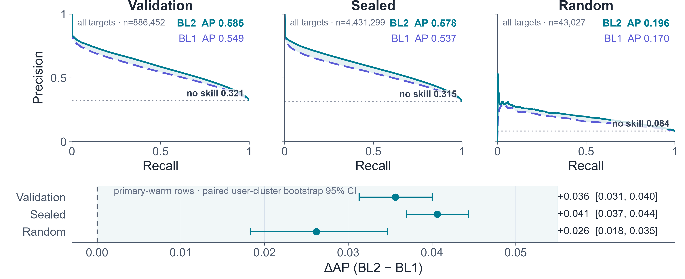

| 评价域 | 行数 | BL1 AP | BL2 AP | BL2 − BL1 ΔAP（95% CI） |
|---|---:|---:|---:|---:|
| Validation | 886,452 | 0.549387 | 0.585013 | +0.035626 [0.031302, 0.040028] |
| sealed | 4,431,299 | 0.537281 | 0.578308 | +0.040651 [0.036937, 0.044402] |
| random | 43,027 | 0.169530 | 0.196344 | +0.026188 [0.018296, 0.034667] |

三个 paired 95% CI 都没有跨过零线。P-R panel 与 forest estimate 使用各自明确声明的行集口径，不能把二者当成可互换的同一份摘要。

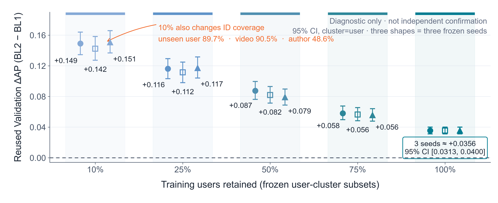

补充敏感性实验包含五个离散训练用户比例，每个比例三个种子，共 15 个点；15/15 的置信区间下界均高于零。但该实验重复使用 Validation 行，因此**不是独立确认**，也不是神经网络结果。

### 5. 在不改变排序的前提下修复概率质量

单调校准会改变概率尺度，但不会改变排序。held-out 校准评价包含 **23,752 行**，真实事件率为 **0.086856**。

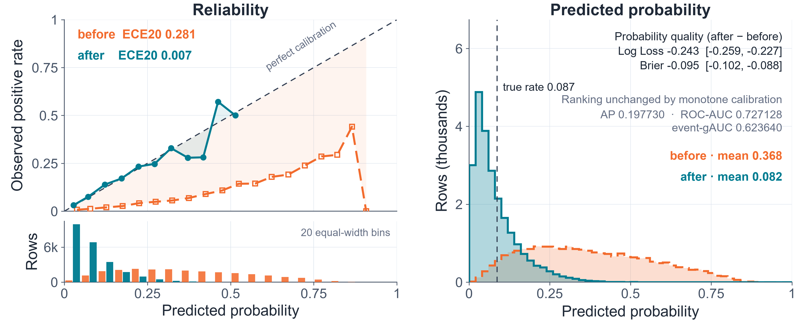

| 指标 | 校准前 | 校准后 | 解释 |
|---|---:|---:|---|
| Log Loss | 0.512076 | 0.268939 | Δ = −0.243137 [−0.258633, −0.226836] |
| Brier score | 0.169978 | 0.074827 | Δ = −0.095151 [−0.102219, −0.087959] |
| ECE（20 bins） | 0.281335 | 0.006724 | 描述性统计；不声称 bootstrap CI |
| AP | 0.197730 | 0.197730 | 排序保持不变 |
| ROC-AUC | 0.727128 | 0.727128 | 排序保持不变 |
| event-gAUC | 0.623640 | 0.623640 | 排序保持不变 |

**本节结论：** 校准显著改善概率质量，但不能被误写成排序指标提升；ROC-AUC 与 event-gAUC 也不能互相混淆。

### 6. 在更晚的内部窗口回放最终模型

最终 replay 包含 **12,399 行、857 名用户**。它是内部 temporal replay，不是外部独立验证。

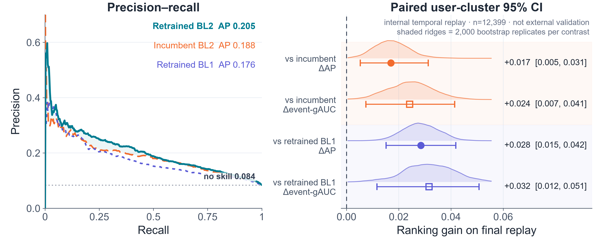

Replay AP 分别为：incumbent 0.187896、retrained BL1 0.176476、retrained BL2 0.204928。相对 incumbent，BL2 的 AP 提升为 **+0.017032 [0.005265, 0.031319]**，event-gAUC 提升为 **+0.024183 [0.007412, 0.041419]**；相对 retrained BL1，对应提升为 **+0.028452 [0.015166, 0.041826]** 和 **+0.031612 [0.011644, 0.050783]**。

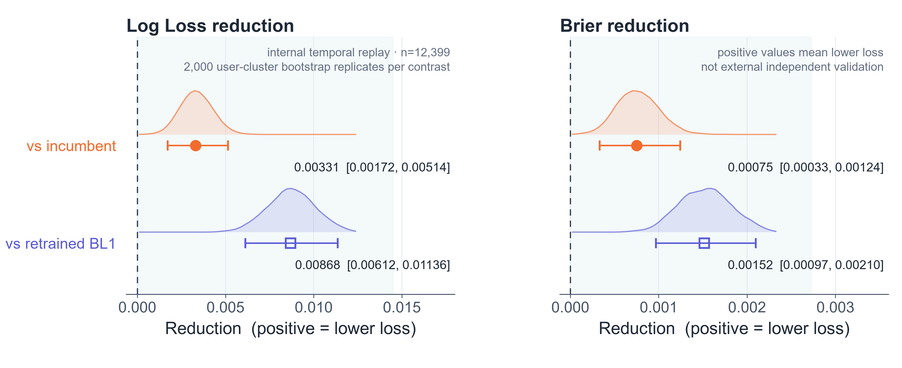

概率指标统一经过方向转换，使“改善”位于右侧。相对 incumbent，Log Loss 降低 **0.003307 [0.001725, 0.005145]**；相对 retrained BL1，降低 **0.008684 [0.006119, 0.011364]**。Brier score 分别降低 **0.000752 [0.000333, 0.001243]** 和 **0.001515 [0.000970, 0.002099]**。

**本节结论：** 内部 replay 同时支持排序与概率质量改善；所有效应均按照“向右代表改善”的方向显示，但结论范围仍限于内部时间回放。

### 7. 把实验结果接入可审计的 Agent 工作流

系统把排序与校准保留为相互协作但分别评价的两条轨道。

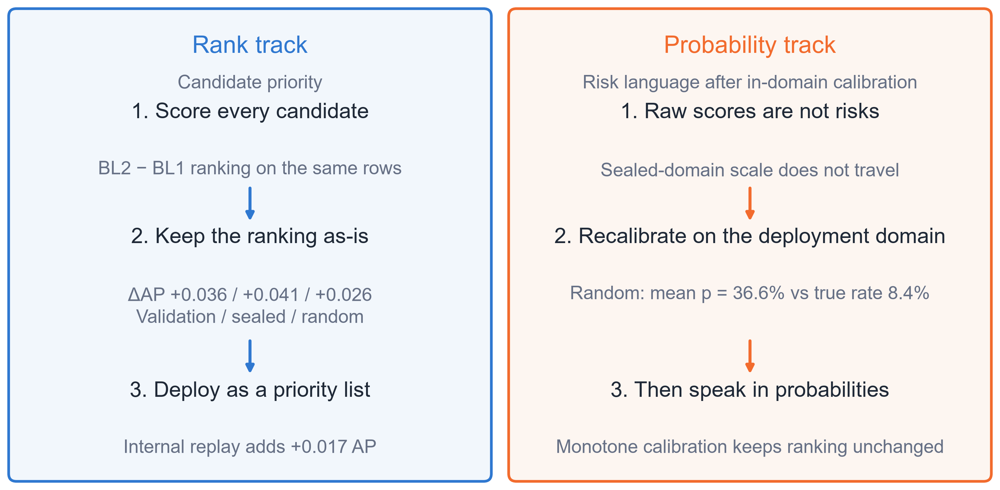

证据边界保证 producer artifact 不会仅仅因为文件存在就自动升级为发布结论；准入、主张审查和审批仍然是明确 gate。

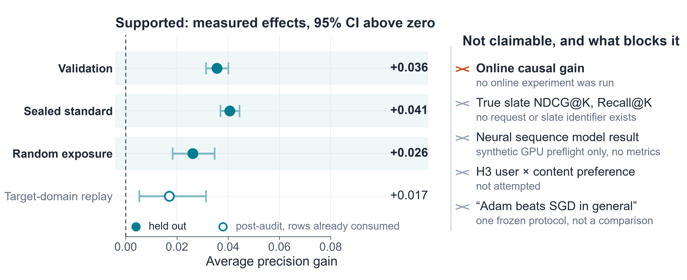

因此，系统贡献是一条完整链路：受治理的数据、point-in-time 特征、配对评价、概率修复，以及 fail-closed 的 Agent Harness。

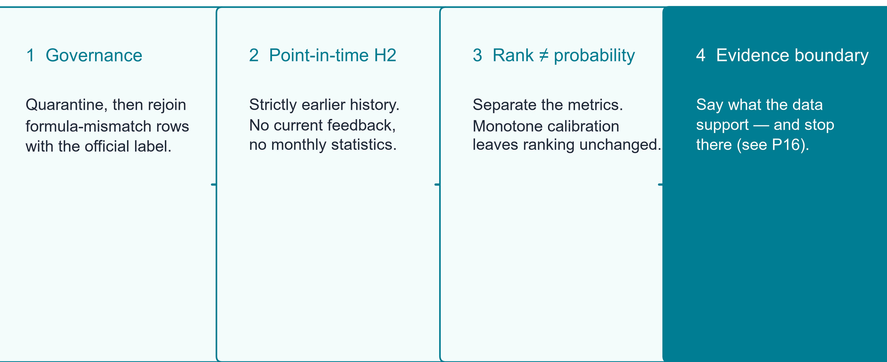

未来工作不能只靠文字扩大当前结论，而必须通过新的证据 gate。下一步包括在其他合适的公开数据集上评价，以及完成下图列出的发布检查；这些都是计划，而不是已经完成的结果。

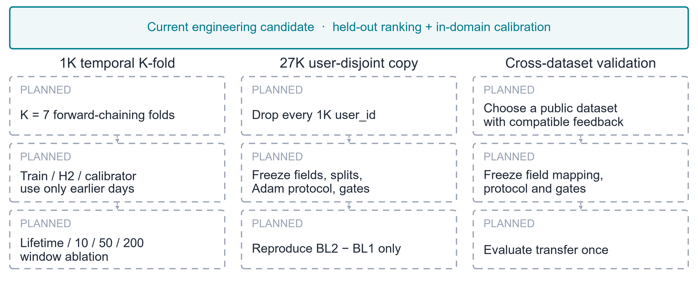

**总体结论：** BL2 在已审计的评价域中相对 BL1 呈现一致的排序增益；单调校准修复了概率质量；更晚窗口支持内部 temporal replay 结论。仓库不会据此声称外部独立验证、线上因果收益或已经获得发布批准。

## 直接运行 Demo

clone 仓库后，在仓库根目录下执行：

```powershell
python scripts/run_agent_system_demo_v001.py `
  --config configs/agent_system_v001.yaml `
  --output-root artifacts/agent_runs `
  --verify
```

预期关键输出：

```text
terminal_state = waiting_for_evidence
verification.verified = true
```

`waiting_for_evidence` 是正确的安全终局：默认 Provider 不提供科研证据，Agent 不能自行把 GPU 快照升级为可发布结论。

运行测试：

```powershell
python -m pip install -e ".[test]"
python -m pytest tests/agent_system -q
```

## 从官方数据开始复现

仓库不使用 Git LFS，也不镜像 KuaiRand 数据。最短路径为：

```powershell
python reproducibility/scripts/download_kuairand_1k.py
python reproducibility/scripts/verify_reproduction.py --raw
python -m pip install -r reproducibility/environment/requirements-release-v010-v012.txt
python reproducibility/scripts/run_reproduction.py --build-silver
python reproducibility/scripts/verify_reproduction.py --silver
```

下载器只接受官方默认地址或用户显式传入的镜像地址；解压后以冻结的逐文件 SHA-256 作为真正的数据身份检查。正式实验的时间切分、种子、bootstrap 次数和合同哈希见 [reproducibility/seeds-and-splits.yaml](reproducibility/seeds-and-splits.yaml)。

完整的 3 分钟展示顺序见 [demo/DEMO_GUIDE.md](demo/DEMO_GUIDE.md)。

## Agent 体系

六个角色按最小权限协作：

| 角色 | 职责 |
|---|---|
| Manager | 冻结研究合同与任务边界 |
| Data Auditor | 审计数据范围和时间泄漏，不重洗数据 |
| Feature Miner | 生成 point-in-time 特征规格 |
| Causal Evaluator | 请求、核验和评价研究证据 |
| Safety Reviewer | 限制结论范围，阻止越界表述 |
| Feature Publisher | 只在证据和审批同时满足时发布，并支持回滚 |

十个类型化 Skill：

`register_research_contract` · `audit_project_boundary` · `propose_feature_specs` · `detect_temporal_leakage` · `request_research_evidence` · `evaluate_research_evidence` · `review_claim_boundaries` · `assess_release_readiness` · `publish_feature_package` · `rollback_feature_package`

默认工作流：

```text
研究合同 → 边界审计 → 特征规格 → 泄漏审计
        → 证据请求 → Gate 评价 → 主张审查 → 发布就绪度
```

每次 Skill 调用依次检查角色权限、预算、幂等键和输出 schema；事件写入哈希链。证据缺失或不匹配时流程停止，不会回填占位结果，也不会自动发布。

## 最小提交结构

```text
NanyangYS_Agent/
├─ README.md
├─ pyproject.toml
├─ configs/
│  └─ agent_system_v001.yaml
├─ scripts/run_agent_system_demo_v001.py
├─ src/kuairand_longseq/
│  ├─ agents/
│  ├─ evidence/
│  ├─ harness/
│  └─ skills/
├─ tests/agent_system/test_agent_system_v001.py
├─ demo/
│  ├─ DEMO_GUIDE.md
│  └─ gpu_train_only_snapshot/
│     ├─ STATUS.md
│     ├─ evidence_bundle_manifest.yaml
│     ├─ run_manifest.json
│     ├─ pooled_metrics.csv
│     ├─ daily_metrics.csv
│     └─ paired_user_cluster_bootstrap.csv
└─ artifacts/agent_runs/                 # 运行时生成，可重建
```

`demo/gpu_train_only_snapshot` 只保留演示所需的小型摘要，没有复制 54 MB 的逐行预测 Parquet、原始数据或训练环境。

## 明确禁止的主张

- 不能称 GPU 快照为 Validation、Gold、sealed-test 或正式发布结果。
- 不能把 BL1 或 BL2 写成神经网络；本研究中的二者都是稀疏逻辑回归。
- 不能把 producer 的 `run_manifest.json` 或 `evidence_bundle_manifest.yaml` 直接传给 `--evidence-manifest`；它们不是 Agent 消费合同所需的 Evidence manifest。
- 不能宣称线上因果收益、全库召回质量或任意策略的离线评估能力。
- 不能宣称 Agent 已训练模型、调用 LLM/GPU，或已取得发布审批。
- 不能把 v012 temporal replay 描述为外部独立验证。
- 不能把补充学习曲线描述为独立确认或神经网络结果；它重复使用 Validation 行。

运行时合同以 `configs/agent_system_v001.yaml`、`src/kuairand_longseq/` 与安全回归测试为准。

## 许可证

### 代码许可证

本项目代码以 **Apache License 2.0** 授权，详见 [LICENSE](LICENSE)。

### 数据集声明

本项目使用以下真实开源视频推荐数据集进行研究：

| 数据集 | 来源 | 数据集许可证 | 引用 |
|---|---|---|---|
| **KuaiRand-1K** | 快手 (Kuaishou) | [CC-BY-SA-4.0](https://creativecommons.org/licenses/by-sa/4.0/) | Gao et al., CIKM 2022 |
| 腾讯视频数据 | 腾讯 (Tencent) | 待接入 | 待补充 |
| 字节跳动数据 | 字节跳动 (ByteDance) | 待接入 | 待补充 |
| YouTube 数据 | YouTube | 待接入 | 待补充 |

**KuaiRand 数据集使用声明：**

- KuaiRand 数据集由 Chongming Gao, Shijun Li, Yuan Zhang, Jiawei Chen, Biao Li, Wenqiang Lei, Peng Jiang, Xiangnan He 等人发布，原始论文为：
  > Gao, C., Li, S., Zhang, Y., Chen, J., Li, B., Lei, W., Jiang, P., & He, X. (2022). KuaiRand: An Unbiased Sequential Recommendation Dataset with Randomly Exposed Videos. *CIKM '22*, Atlanta, GA, USA. [DOI: 10.1145/3511808.3557624](https://doi.org/10.1145/3511808.3557624)
- 数据集主页：<https://kuairand.com> · GitHub 仓库：<https://github.com/chongminggao/KuaiRand>
- 该数据集以 **CC-BY-SA-4.0** 许可发布，使用时需署名，且基于该数据集的衍生作品须以相同许可证共享。
- 本项目**不分发数据集本身**，仅提供基于该数据集的研究代码与实验结果。使用者需自行从官方渠道获取数据集并遵守其许可证条款。
