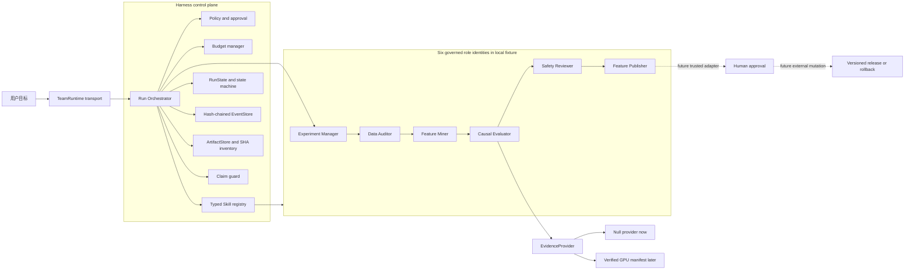
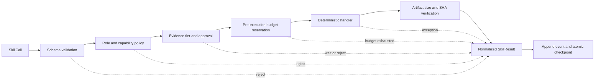
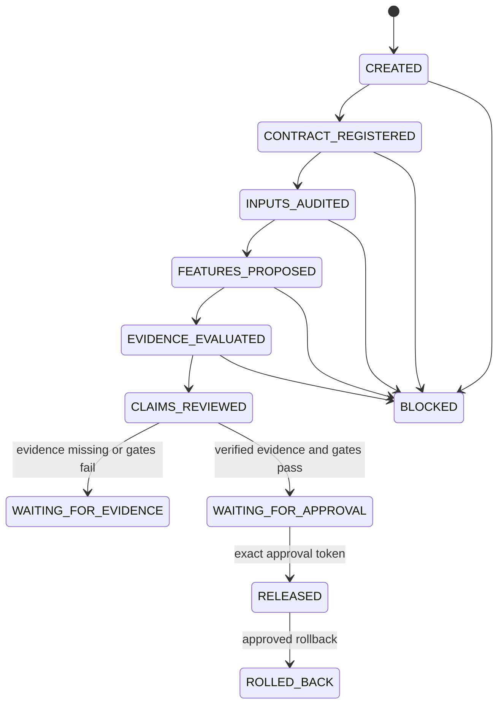

# CausalFeatureOps Agent 系统设计与可运行骨架 v0.1

更新时间：2026-08-16  
状态：**Agent Infra v0.1 已可离线运行；真实 AgentTeams 适配、GPU 模型证据和可发布科研结论尚未完成。**

## 1. 当前交付的结论

本轮先完成不依赖显卡的 Agent 系统控制平面，并把研究计算抽象成可替换的 `EvidenceProvider`。当前系统能够：

- 运行 6 个权限不同的角色 identity 和 10 个有版本的结构化 Skill 合同；当前由确定性本地 Harness 执行，并非 6 个 AgentTeams worker；
- 生成结构化 Task Graph、role handoff、Skill Result、状态转换、实现文件 SHA 和哈希制品清单；
- 对每次 Skill 调用执行顶层输入/输出结构、角色、权限、预算、审批和产物哈希校验；嵌套 JSON Schema 仍待补齐；
- 用 append-only、SHA-256 链式事件日志保存运行轨迹；
- 拒绝当前/未来反馈字段、封存数据访问、越权发布和不匹配的审批；
- 在 GPU/模型证据不存在时，诚实终止为 `WAITING_FOR_EVIDENCE`；
- 后续通过一个完成且满足冻结 scope/provenance/hash 的 Evidence Manifest 接入真实实验，而不修改 Harness；生产启用前仍需可信授权 attestation。

当前系统**没有**做以下事情：

- 没有重新清洗 Silver；
- 没有读取 Raw、Silver Parquet、Gold、Validation、restricted 或 random 数据；
- 没有训练模型或调用 GPU；
- 没有调用 LLM 或外部 API；
- 没有把示例数值、synthetic 数据或设计文档当成科研结论；
- 没有声称已完成真实 AgentTeams SDK 集成。

## 2. 与比赛要求的对应

GOAI Agent Infra 赛道要求至少 3 个不同职能 Agent，以 AgentTeams 为协同设计基点，包含 Skill，并能说明任务拆解、上下文传递、工具调用、验证、证据、安全、审批和回滚。官方还要求复赛阶段提供可执行代码包和可运行 Demo。依据见 [GOAI Agent Infra 赛道](https://www.goaihz.com/tracks?track=infra) 与 [AgentTeams 官方仓库](https://github.com/agentscope-ai/AgentTeams/)。

| 比赛项 | v0.1 落点 | 当前判定 |
|---|---|---|
| 至少 3 个不同职能 Agent | 已实现 6 个独立 role identity、权限与 Skill 集；AgentTeams worker 当前为 0 | 角色设计和本地 fixture 已实现；比赛可执行要求待真实 adapter |
| AgentTeams 协同基点 | 定义结构化 Task/Result 和 `TeamRuntime` 适配边界 | 设计完成；真实 SDK 适配待完成 |
| Skill 必选 | 10 个有版本、浅层输入/输出 Schema、权限、超时元数据、reason code、幂等性的结构化 Skill | 首版可执行；完整 JSON Schema 与同步 timeout/cancellation enforcement 待实现 |
| 端到端闭环 | 合同 → 审计 → Feature Spec → 证据 → Gate → Claim Review → 发布就绪 | 已实现无研究证据分支 |
| 验证与证据 | Artifact SHA、Evidence Tier、ClaimGuard、Gate Verdict | 已实现首版 |
| 安全与审批 | sealed 默认拒绝；发布/回滚需合同与 subject 绑定的 token | fail-closed 合同 stub；可信审批 adapter 未实现且开关关闭 |
| 状态持久化和可观测 | Hash-chain events、原子 state checkpoint、run manifest | 持久化已实现；resume/replay API 待实现 |
| 可运行 Demo | 一条命令离线运行并做 run-local 哈希自洽性复核 | 已实现 CLI；UI/聊天室待完成 |

重要边界：`local_structured_v1` 是当前可测试的本地 transport，不伪装成 AgentTeams。进入比赛提交前，必须实现真实 AgentTeams adapter，并用同一套 Harness 合同做 E2E 测试。

## 3. 为什么把科研结果做成插槽

Agent Infra 的工程证据和模型研究的科学证据是两种不同证据：

| 证据 | 能支持什么 | 不能支持什么 |
|---|---|---|
| System evidence | 系统是否分派任务、拒绝越权、保存制品和状态 | 模型是否更好 |
| Train-only evidence | 已登记 Train 范围内的探索性关联和配对结果 | Validation、test、线上泛化 |
| Validation evidence | 冻结模型在固定 Validation 的离线门禁 | sealed test、线上因果收益 |
| Sealed-test evidence | 冻结协议下的一次最终离线结论 | 任意策略 OPE、线上因果收益 |

把 GPU 研究封装为 Evidence Manifest 有三个好处：

1. 显卡机器暂时不可用时，Agent 系统仍可开发和验收；
2. 实验结果回来后只替换证据 Provider，不重写 Orchestrator；
3. 系统会拒绝 placeholder、scope/provenance 不匹配或 size/hash 损坏的文件；v0.1 尚未实现基于时间戳/nonce 的 freshness 策略。

## 4. 总体架构



### 4.1 两层循环

- `Run Orchestrator` 是 session/run 级 Harness，独占权威 RunState、预算、审批、事件和制品。
- Agent/request loop 只处理一个有界任务并提出 Skill Call；它不能直接修改权威状态。

这使 Agent 的自然语言推理不成为权限或指标来源。系统只保存任务、动作、结果和证据引用，不记录或依赖隐藏思维链。

## 5. 六个角色 identity（当前不是 AgentTeams worker）

| Agent | 输入 | 输出 | 硬边界 |
|---|---|---|---|
| Experiment Manager | 目标、研究边界 | Run Contract、Task Graph | 不读数据、不伪造指标、不发布 |
| Data Auditor | 已登记政策与 Feature 字段 | 边界审计、泄漏审计 | 不清洗、不训练、不打开 sealed |
| Feature Miner | Feature allow/deny policy | PIT Feature Specs | 不用当前反馈、不提升未验证特征 |
| Causal Evaluator | Evidence Envelope、冻结 Gate | Gate Verdict | 不改候选、不改阈值、不作线上因果声明 |
| Safety Reviewer | 全部证据与限制 | Allowed/Forbidden Claims | 不把 synthetic 或 unavailable 升格 |
| Feature Publisher | Gate、Claim Review、审批 | Readiness、Release、Rollback | 无审批不发布、不覆盖旧版本 |

## 6. Skill 生命周期

每个调用都遵循同一条控制链。无论未知 Skill、非法输入、拒绝、异常还是成功，都会返回统一 `SkillResult`。v0.1 的 Schema 校验只覆盖必需顶层字段、禁止额外输入、输出必需字段/状态和三个容器类型；尚不等同于完整 JSON Schema 验证。



当前 10 个 Skill：

1. `register_research_contract`
2. `audit_project_boundary`
3. `detect_temporal_leakage`
4. `propose_feature_specs`
5. `request_research_evidence`
6. `evaluate_research_evidence`
7. `review_claim_boundaries`
8. `assess_release_readiness`
9. `publish_feature_package`
10. `rollback_feature_package`

发布与回滚合同要求未来由可信 Approval Adapter 发行的 Token 同时绑定：

- action；
- 当前 contract SHA-256；
- 被审批的精确 subject SHA-256；
- approver 与状态。

当真实 Adapter 以 Harness 计算的 package digest 发行并单次消费 Token 后，审批后替换包内容才会被拒绝。v0.1 还没有实现这条真实发布路径。

但 v0.1 的 `approval_adapter_enabled` 固定为 false，代码还没有可信 token 发行/登记/单次消费 API。因此发布与回滚目前只是会 fail closed 的合同 stub，不能表述为“已可真实发布”。

## 7. 状态机



当前无 GPU 运行的正确终局是 `WAITING_FOR_EVIDENCE`，不是 `COMPLETED` 或 `RELEASED`。

## 8. Loop Engineering

Loop Engineering 不是让 Agent 无限“反思”，而是为每类循环预注册预算、成功门和停止门。v0.1 使用固定 DAG，因而按构造只执行下表的一轮路径；`loops` 目前是设计合同，不是已完成的通用 loop scheduler。

| Loop | 最大范围 | 成功门 | 停止门 |
|---|---:|---|---|
| Contract | 1 round | Task Graph 被登记 | 合同冲突 |
| Audit | 1 round | 无数据权限违规 | 清洗、Raw、sealed 或递归发现请求 |
| Feature | 4 families / 1 round | Feature Spec 完整 | 需要真实证据 |
| Evidence | 1 manifest read | verified 或明确 unavailable | hash、scope、authorization 异常 |
| Release | 1 attempt | 人工审批并提交 | 缺证据、缺审批或 Gate 失败 |

运行时会在执行前动态检查 steps、Skill calls、write-capable calls、sealed reads 和 publish calls。v0.1 同时声明：

- 16 steps；
- 16 Skill calls；
- 16 次 write-capable Skill 调用额度（不是实际文件数）；
- 0 retries；
- 0 sealed reads；
- 1 publish attempt；
- 0 LLM calls；
- 0 GPU seconds。

其中 retries、LLM calls、GPU seconds 在当前内建 DAG 中没有对应执行器，所以保持为 0；通用重试、LLM/GPU 资源记账和循环级动态 enforcement 仍待实现，不能据此宣称已有完整 scheduler。

外部科研证据另受固定读取边界约束：每个 run 最多读取 1 份 manifest、64 个显式登记制品、合计 20 GiB；禁止递归发现。Provider 只为验 size/SHA 顺序读取这些显式路径，读取次数和近似字节数进入 `run_manifest.json`。

未来训练预算属于 GPU 实验合同，不应偷偷扩展 Agent Harness 的循环预算。

## 9. Evidence Manifest 接口

真实实验机器完成研究后，把同目录下的预测、指标、Gate 和 lineage 文件登记为：

```yaml
schema_version: "1.0"
evidence_id: authorized_gpu_run_id
evidence_kind: paired_model_comparison
status: complete
tier: validation
claim_eligible: true
execution_authorized: true
contract_sha256: ...
code_sha256: ...
input_manifest_sha256: ...
model_config_sha256: ...
authorization_sha256: ...
models:
  - static_baseline
  - strict_statistical_history
  - short_sequence
  - long_sequence
scope:
  dataset: KuaiRand-1K
  task: candidate_long_view_probability_prediction
  split: validation
  target_manifest_sha256: ...
metrics:
  average_precision_delta: ...
gates:
  ranking_superiority: pass
  user_gauc_noninferiority: pass
  logloss_noninferiority: pass
  brier_noninferiority: pass
  temporal_leakage_audit: pass
limitations: []
artifacts:
  - path: predictions/paired.parquet
    size_bytes: ...
    sha256: ...
```

Provider 的硬规则：

- `status` 必须是 `complete`；
- `execution_authorized` 和 `claim_eligible` 必须为 true；
- placeholder 和 synthetic 永远不能成为科学证据；
- artifact 必须位于 manifest 目录内，路径不能逃逸；
- contract、代码、输入 manifest、模型配置和授权 attestation 必须各有合法 SHA-256；
- evidence kind、task、split 和 Evidence Tier 必须覆盖请求范围；
- dataset、model set、target manifest 与全部 provenance hashes 必须和消费方配置中**事先冻结**的期望值逐项一致；manifest 自报“已授权”不构成信任；
- size 和 SHA-256 必须逐项匹配；
- Schema 版本必须精确为当前支持的 `1.0`；
- unavailable 证据的 metrics 必须为空；
- Train-only 证据不能支持 Validation 或 test 声明；
- Gate 缺失或失败时不得进入发布审批。

模板位于 `configs/research_evidence_manifest_template_v001.yaml`。它故意保持 `pending`、`claim_eligible: false` 和 `placeholder: true`，因此不能被当前系统误接受。

## 10. 将真实 GPU 结果接入的固定步骤

1. GPU 机器按冻结实验合同输出 prediction、metrics、gates、code/config/input hashes。
2. 独立验证脚本核对固定目标行、PIT 边界、指标和制品哈希，并生成授权 attestation；生产启用还需要验证其签名或受信发行来源。
3. 复制模板并填写真实 manifest；删除 placeholder 字段，设为完成和已授权。
4. 在受信 attestation adapter 完成后，版本化修订 `agent_system_v001.yaml` 的 `expected_dataset` 与 `expected_provenance`，填入独立批准的精确 SHA。当前 null 会有意拒绝所有外部科研 manifest；仅填写公开 SHA 并不自动构成授权。
5. 运行：

   ```powershell
   ..\.venv\Scripts\python.exe scripts\run_agent_system_demo_v001.py `
     --evidence-manifest <GPU交付目录\manifest.yaml> --verify
   ```

6. `ManifestEvidenceProvider` 只做 scope/provenance/size/hash 验收，不重新训练或重算指标，并把同一份已解析 bytes 原样归档到 run 目录；这仍不是签名授权验证。
7. Gate 全部通过后，系统只进入 `WAITING_FOR_APPROVAL`；仍不自动发布。
8. 实现可信审批 adapter 后，人工审批绑定精确 subject SHA，Publisher 才能提交版本；当前 v0.1 仍会拒绝该动作。

## 11. AgentTeams 接入计划

当前代码把 transport 隔离为 `TeamRuntime.dispatch(AgentTask) -> SkillResult`。真实 AgentTeams 适配需要：

1. 把 6 个 identity 映射为 AgentTeams leader/workers；
2. 把 AgentTeams message 转成 `AgentTask`，只传 `context_keys` 指定的最小上下文；
3. 所有 tool/Skill 调用仍回到本项目 `SkillExecutor`；
4. AgentTeams 不能直接写 RunState、访问数据或发布；
5. AgentTeams 中断、超时和 worker failure 必须转成规范化 Skill/Task Result；
6. AgentTeams 聊天室/UI 只展示 RunState 和 ArtifactRef，不自行生成指标；
7. 用当前本地 backend 与 AgentTeams backend 跑同一 fixture，比较终局、事件类型和制品哈希语义。

只有完成以上 adapter 和 E2E，才能在比赛材料中写“AgentTeams 已集成”。

## 12. 从 Claude Code 研究材料借鉴了什么

本项目只 clean-room 借鉴行为模式，不复制源码、提示词、品牌类型名或序列化格式。研究材料本身是从 npm 包提取的逆向学习快照，存在许可限制，因此比赛提交必须保持原创实现。

借鉴的模式：

- session Harness 与 request loop 分层；
- schema validation、policy、permission、approval、execution、post verification 的工具生命周期；
- 所有失败路径都有配对的结构化结果；
- 默认串行，只有明确证明 concurrency-safe 的 Skill 才可并行；
- append-only transcript/event 与 checkpoint；事件完整性读取已实现，但从 checkpoint 自动续跑的恢复 API 尚未实现；
- compaction 保存结构化 objective、gates、budgets、approvals、artifacts 和 next transition，而不只是自然语言摘要；
- max turns、费用/资源预算和中断是显式终止状态。

本项目使用自己的 Python dataclass、枚举、事件格式、reason code 和测试重新实现上述职责。

只读研究时核对的本地位置包括：

- `claude-code-source-code-main/README_CN.md:1-6,173-180`：材料来源与许可边界；
- `src/QueryEngine.ts:130-206,430-460,675-730`：run 级状态、预算与持久化；
- `src/query.ts:219-321,1704-1728`：request loop 与显式 next state；
- `src/Tool.ts:379-406,483-503`：工具 Schema、并发和语义验证；
- `src/services/tools/toolExecution.ts:614-733,795-1035,1178-1222,1381-1531`：完整工具生命周期；
- `src/services/tools/StreamingToolExecutor.ts:34-39,126-230,407-439`：并发安全与结果顺序；
- `src/services/compact/compact.ts:918-952,1399-1505`：结构化上下文恢复。

这些位置只用于提炼运行时责任，不作为复制实现的来源。

## 13. 如何运行

从项目根目录执行：

```powershell
..\.venv\Scripts\python.exe scripts\run_agent_system_demo_v001.py --verify
```

输出示例：

```text
terminal_state: waiting_for_evidence
verification.verified: true
LLM calls: 0
GPU seconds: 0
sealed reads: 0
```

CLI 同时返回 `artifact_manifest_sha256`，并核对 run manifest 中固定实现文件 allowlist 的 SHA。inventory root 只有在被记录到 run 目录之外时，才能作为外部信任根；目录内 verifier 本身只证明当前源码与声明、inventory 覆盖和各 size/SHA 自洽，不能抵抗攻击者同时重写全部文件、源码和 inventory。

运行制品结构：

```text
artifacts/agent_runs/<run_id>/
├─ contracts/run_contract.json
├─ task_graph.json
├─ audits/
├─ feature_specs/
├─ evidence/
├─ evaluation/
├─ safety/
├─ release/readiness.json
├─ events.jsonl
├─ state.json
├─ reports/final_report.md
├─ run_manifest.json
└─ artifact_manifest.json
```

## 14. 当前完成度与下一阶段

### 已完成

- 六角色 identity、本地确定性 role fixture 与 least-privilege policy；
- 10 个可执行 Skill；
- 状态机、预算、幂等缓存、ArtifactStore、EventStore；
- Null/Manifest Evidence Provider；
- Claim boundary 和 release readiness；
- 合同/subject 绑定的发布与回滚策略 stub；可信审批 adapter 未完成，外部 mutation 默认硬禁用；
- 离线 CLI 与自动哈希校验；
- no-GPU、leakage、tamper、evidence handoff、policy 等测试。
- Agent 系统专项测试数量以 checkpoint 的最新验证快照为准。

### 比赛前仍需完成

1. 真实 AgentTeams SDK adapter 与 AgentTeams E2E；
2. 运行恢复 API：从 state + events 继续未完成任务；
3. context snapshot/compaction 与多 worker 取消语义；
4. sealed access 的一次性 consumption token 和人工 UI；
5. WebUI/聊天室可视化 Demo；
6. GPU 实验 Evidence Manifest 与独立复核；
7. 真实 release registry 和 rollback fixture；
8. Evidence freshness timestamp/nonce 和可信签名 attestation；
9. clean install、CI、打包与开源许可审查。

因此 v0.1 是可信的 Agent Infra 基座，不是最终比赛成品，也不是科研结果报告。
